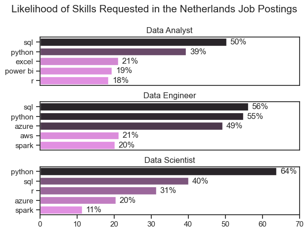
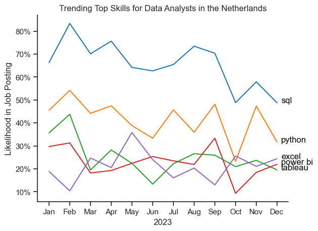
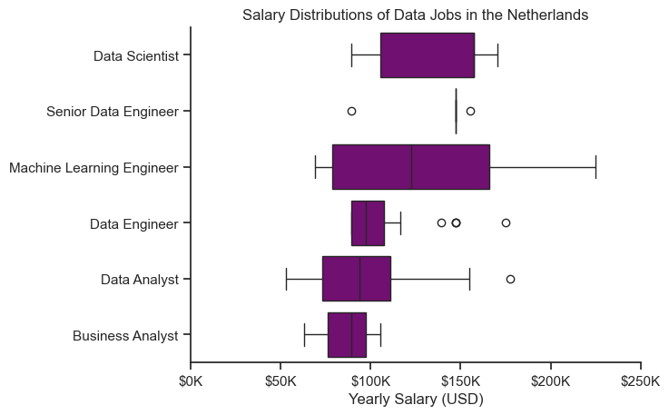
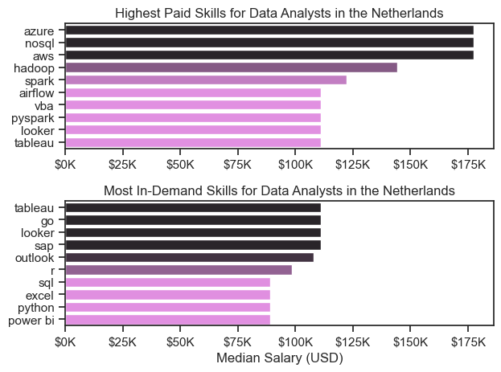
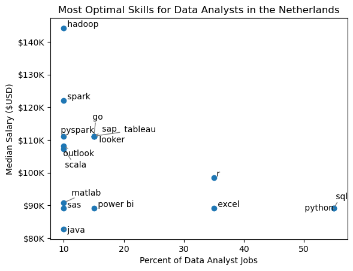
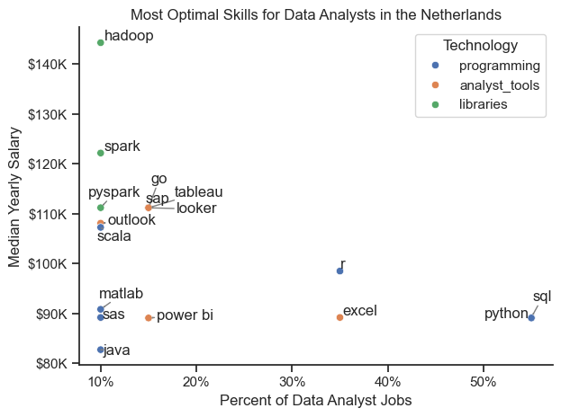

# Introduction

Welcome to my overview of the data job market, with a focus on data analyst roles. I created this project to better understand and navigate the job market. It examines the highest-paying and most in-demand skills to help identify the best job opportunities for data analysts.


### Data
The data used comes from Luke Barousse's Python Course, which offers detailed insights on job titles, salaries, locations, and key skills. Using Python scripts, I explore important questions such as the most sought-after skills, salary trends, and how demand and salary intersect in the field of data analytics.


# Key Questions Explored

Here are the questions my project aims to answer:

- What are the most in-demand skills for the top 3 popular data roles?
- What are the trending in-demand skills for Data Analysts?
- How well do Data Analyst jobs and skills pay?
- What are the best skills for data analysts to learn? (High Demand and High Pay)

# Tools Utilized

For my in-depth exploration of the data analyst job market, I used several essential tools:

- **Python**: The core tool for analyzing data and uncovering key insights.
- **Pandas Library**: For data analysis.
- **Matplotlib Library**: For data visualization.
- **Seaborn Library**: For advanced data visualizations.
- **Jupyter Notebooks**: To run Python scripts, and easily include notes and analysis.
- **Visual Studio Code**: My main tool for executing Python scripts.
- **Git & GitHub**: For version control, sharing code, and ensuring collaboration and project tracking.

# Data Cleaning and Preparation

This section details the steps taken to prepare and clean the data for accurate and usable analysis.

## Data Import and Cleanup

I begin by importing the needed libraries and loading the dataset, then perform initial cleaning to ensure the data is of good quality.

```python
# Importing Libraries
import pandas as pd
import matplotlib.pyplot as plt  
import seaborn as sns
import ast
from datasets import load_dataset


# Loading Data
dataset = load_dataset('lukebarousse/data_jobs')
df = dataset['train'].to_pandas()

# Data Cleanup
df['job_posted_date'] = pd.to_datetime(df['job_posted_date'])
df['job_skills'] = df['job_skills'].apply(lambda x: ast.literal_eval(x) if pd.notna(x) else x)
```

## Focus on the Netherlands-Based Jobs

To concentrate on the Netherlands job market, I filter the dataset to include only roles based in the Netherlands.

```python
df_DA_NL = df[df['job_country'] == 'Netherlands']
```

# Analysis Overview

The Jupyter notebooks for this project were designed to explore different aspects of the data job market. Here’s the approach taken for each question:

## 1. What skills are most needed for the top 3 popular data roles?

To identify the most in-demand skills for the top 3 data roles, I first determined the most popular positions and then found the top 5 skills for each of these roles. This analysis reveals the key skills for the most popular job titles, helping to focus on the skills needed for each role.

Check out my notebook with detailed steps here: [2_Skills_Demand](3_Project/2_Skills_Demand.ipynb).

### Data Visualization

```python
fig, ax = plt.subplots(len(job_titles), 1)


for i, job_title in enumerate(job_titles):
    df_plot = df_skills_perc[df_skills_perc['job_title_short'] == job_title].head(5)
    sns.barplot(data=df_plot, x='skill_percent', y='job_skills', ax=ax[i], hue='skill_count', palette='dark:violet_r')
    ax[i].set_title(job_title)
    ax[i].set_ylabel('')
    ax[i].set_xlabel('')
    ax[i].get_legend().remove()
    ax[i].set_xlim(0, 70)

plt.show()
```
## Results



_Bar chart showing salaries for the top 3 data roles and their top 5 associated skills._

### Key Findings:

- **SQL** is the top requested skill for Data Analysts and Data Engineers, appearing in over half of the job postings for both roles. It is also requested for Data Scientist roles with 40%. 
- **Python** is the most sought-after skill for Data Scientists, found in 64% of their job postings.
- Data Engineers need more specialized technical skills (like AWS, Azure, Spark) compared to Data Analysts and Data Scientists, who focus on general tools (such as Excel, Tableau).
- **Python** is in high demand across all three roles but is most critical for Data Scientists (64%) and Data Engineers (55%).

## 2. What are the trending skills for Data Analysts?

To track skill trends for Data Analysts in 2023, I filtered job postings by month and grouped the skills accordingly. This revealed the top 5 skills for each month, showing how their popularity changed throughout the year.

Check out my notebook with detailed steps here: [3_Skills_Trend](3_Project/3_Skills_Trend.ipynb)

### Data Visualization

```python
from matplotlib.ticker import PercentFormatter

df_plot = df_DA_NL_percent.iloc[:, :5]
sns.lineplot(data=df_plot, dashes=False, legend='full', palette='tab10')
sns.set_theme(style='ticks')

plt.show()
```

## Results


_Bar chart showing the top trending skills for data analysts in the Netherlands for 2023._

### Key Findings

- **SQL** is the most consistently requested skill throughout the year but shows a gradual decline in demand.
- **Python** is in-demand skill requested following SQL.
- **Tableau** had stable demand with some fluctuations but remained crucial for data analysts.
- **Excel** also had a stable request throughoutr the year. 
- **Power BI** had saimilar demand as Tableau and Excel, but showed a slight upward trend towards the end of the year over Tableau.
- **Tableau**, **Excel**, and **Power BI** had similar demand throughout the year, with only minor fluctuations. By year-end, all three had comparable demand for Data Analyst roles. 

## 3. How much do Data Analysts earn based on their skills?

To find the highest-paying roles and skills, I focused on jobs in the Netherlands and checked their median salaries. I first reviewed the salary distributions for common data jobs like Data Scientist, Data Engineer, and Data Analyst to see which ones offer the highest pay.

Check out my notebook with detailed steps here: [4_Salary_Analysis](3_Project/4_Salary_Analysis.ipynb)

### Data Visualization

```python
sns.boxplot(data=df_NL_top6, x='salary_year_avg', y='job_title_short', order=job_order, color='purple')
sns.set_theme(style='ticks')
sns.despine()

ticks_x = plt.FuncFormatter(lambda y, pos: f'${int(y/1000)}K')
plt.gca().xaxis.set_major_formatter(ticks_x)
plt.show()

```

### Results



_Box plot showing the salary ranges for the top 6 data job titles._

### Key Findings

- **Salary ranges vary widely** across different job titles. Machine Learning Engineers have the highest salary potential, reaching up to $225K, reflecting the high value of advanced skills and experience.
  
- **Data Scientist** roles have high stable salary range, indicating that exceptional skills can lead to higher pay. 

- **Data Analyst** roles have more consistent salaries with very fewer high-end outliers.

- **Buisness Analyst** follows the satble range as well with no outliers. 

- **Data Engineer** roles have the most high-end outliers ranging till $175K. 

- **Median salaries rise** with seniority and specialization. Senior roles (like Data Scientist) not only offer higher median salaries but also show greater salary variation, reflecting increased responsibilities.

### Top-Paying and Most In-Demand Skills for Data Analysts
Next, I focused solely on data analyst roles and examined both the highest-paid and most in-demand skills. I used two bar charts to display these findings.

### Data Visualization

```python
fig, ax = plt.subplots(2, 1)  

# Top 10 Highest Paid Skills for Data Analysts
sns.barplot(data=df_DA_top_pay, x='median', y=df_DA_top_pay.index, hue='median', ax=ax[0], palette='dark:violet_r')
ax[0].legend().remove()

ax[0].xaxis.set_major_formatter(plt.FuncFormatter(lambda x, _: f'${int(x/1000)}K'))


# Top 10 Most In-Demand Skills for Data Analysts')
sns.barplot(data=df_DA_skills, x='median', y=df_DA_skills.index, hue='median', ax=ax[1], palette='light:violet')
ax[1].legend().remove()

ax[1].xaxis.set_major_formatter(plt.FuncFormatter(lambda x, _: f'${int(x/1000)}K'))

plt.show()
```

### Results



_Bar charts showing the highest-paid and most in-demand skills for data analysts in the Netherlands._

### Key Findings

- The top graph shows that specialized technical skills in cloud technology like azure and aws lead to higher salaries, with some reaching up to $175K, indicating that advanced technical skills can boost earning potential.

- The bottom graph reveals that the BI tools like, Tableau, Go, and Looker pays high and the essential skills like Python, Excel, and SQL are the most in-demand as well, even though they may not offer the highest salaries. This highlights the importance of these core skills for job opportunities in data analysis.

- There is a clear difference between the highest-paying skills and the most in-demand ones. Data analysts should aim to develop a mix of both high-paying specialized skills and widely sought-after foundational skills to maximize their career potential.

## 4. Which skill should Data Analysts learn to maximize demand and pay?

To find the best skills to learn (those that are both highly paid and in demand), I calculated the percentage of job postings requiring each skill and their median salaries. This helps to easily spot the most valuable skills to acquire.

Check out my notebook with detailed steps here: [5_Optimal_Skills](3_Project/5_Optimal_Skills.ipynb)

### Data Visualization

```python
from adjustText import adjust_text

plt.scatter(df_DA_skills_high_demand['skill_percent'], df_DA_skills_high_demand['median_salary'])

# Get current axes, set limits, and format axes
ax = plt.gca()
ax.yaxis.set_major_formatter(plt.FuncFormatter(lambda y, pos: f'${int(y/1000)}K'))  # Example formatting y-axis

# Adjust text to avoid overlap and add arrows
adjust_text(texts, arrowprops=dict(arrowstyle='->', color='gray'))

plt.show()
```

### Results



_Scatter plot showing the best skills for data analysts in the Netherlands, based on high pay and high demand._

### Key Findings

- **Python** and **SQL**, the most commonly required skills for data jobs, are frequently listed with median salaries around $90K.

- **Excel** and **R** are also frequently required, but **R** has a higher median salary of about $100K.

- **Power BI** has a similar salary range to **Excel**, **Python**, and **SQL**, but is less commonly listed. **Tableau** has a similar presence to these tools and also offers high pay.

- Mastering skills like **Python**/**R**, **SQL**, **Excel**, and **Tableau**/**Power BI** can lead to excellent job opportunities in data analytics.

- **Hadoop** has the highest median salary at nearly $145K, even though it appears less often in job postings, showing the high value of specialized database skills.

### Visualizing Various Technologies


The following section displays the different technologies in the graph. We'll use color labels to represent each technology (e.g., {Programming: Python}).

### Data Visualization

```python
from matplotlib.ticker import PercentFormatter

sns.scatterplot(
    data=df_DA_skills_tech_high_demand,
    x='skill_percent',
    y='median_salary',
    hue='technology'
)

ax = plt.gca()
ax.yaxis.set_major_formatter(plt.FuncFormatter(lambda y, pos: f'${int(y/1000)}K'))
ax.xaxis.set_major_formatter(PercentFormatter(decimals=0))

plt.show()
```

### Results



_Scatter plot showing the best skills for data analysts in the US, with color labels for each technology._

### Key Findings

- **Programming skills** (colored blue) generally show higher appearances in the scatter plot, suggesting that programming expertise can lead to better opportunities in data analytics.

- **Analyst tools** (colored orange), such as Tableau and Power BI, are common in job postings and offer competitive salaries. This highlights the importance of visualization and data analysis tools in today's data roles, with good pay and versatility across various data tasks.

- **Database skills** (colored green), like Hadoop and Spark Server, are linked to some of the highest salaries, indicating a strong demand for data management and manipulation skills.


# Key Takeaways

During this project, I gained a better understanding of the data analyst job market and improved my Python skills, particularly in data manipulation and visualization. Here’s what I learned:

- **Advanced Python Usage**: Using libraries like Pandas for data manipulation and Seaborn and Matplotlib for visualization made complex tasks much easier and more efficient.

- **Data Cleaning is Key**: I realized that cleaning and preparing data thoroughly is essential for accurate analysis and reliable insights.

- **Aligning Skills with Market Needs**: The project showed the importance of matching your skills with what the job market demands. Knowing how skills relate to salary and job availability helps in planning a better career in tech.

# Findings

This project offered a few key takeaways about the data job market for analysts:

- **Skill Demand and Salary Link**: Higher demand skills, like Python often lead to better salaries.

- **Market Trends**: The demand for skills changes over time, showing that the data job market is constantly evolving. Staying current with these trends is crucial for career growth.

- **Value of Skills**: Knowing which skills are both in high demand and well-paid helps data analysts choose which skills to learn for better financial rewards.

# Challenges Encountered
This project had its challenges but offered valuable learning experiences:

- **Data Inconsistencies**: Dealing with missing or inconsistent data required careful cleaning to maintain accurate analysis.

- **Complex Visualization**: Creating clear and effective visualizations for complex data was challenging but essential for presenting insights effectively.

- **Balancing Depth and Breadth**: It was challenging to balance detailed analysis with a broad overview of the data to ensure thorough coverage without getting bogged down in specifics.

# Summary

This exploration of the data analyst job market has been very enlightening, showing key skills and trends that define this evolving field. The insights gained improve my understanding and offer practical advice for advancing a career in data analytics. As the market keeps evolving, regular analysis will be crucial to staying ahead. This project provides a solid base for future work and highlights the need for ongoing learning and adaptability in the data field.

